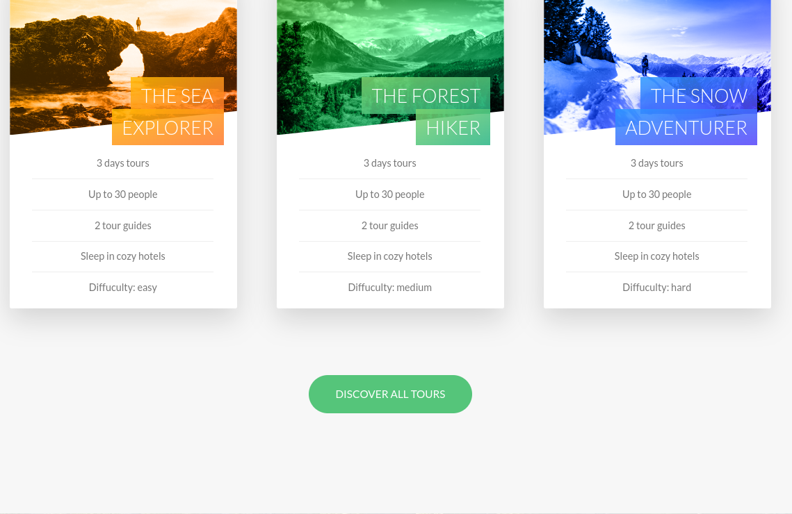

# Example SASS Natours Project for Reference

## Examples

- Responsive design mixin: [\_mixins.scss](./sass/abstracts/_mixins.scss#L38)

- Main design and change rem units (responsive): [\_base.scss](./sass/base/_base.scss)

- Animations & show/hide background of animated component: [\_typography.scss](./sass/base/_typography.scss#L5)

- Clip as text width: [\_typography.scss](./sass/abstracts/_typography.scss#L47)

- Clip video don't change aspect ratio: [\_bg-video.scss](./sass/components/_bg-video.scss#L14)

- Link & Visited pseudo classes: [\_button.scss](./sass/components/_button.scss#L4)

- After pseudo class: [\_button.scss](./sass/components/_button.scss#L57)

- animation-fill-mode: [\_button.scss](./sass/components/_button.scss#L72)

- perspective : [\_card.scss](./sass/components/_card.scss)

- box-decoration-break: [\_card.scss](./sass/components/_card.scss#L110)

- Linear gradient examples: [\_card.scss](./sass/components/_card.scss#L113), [\_home.scss](./sass/pages/_home.scss#L61)

- Checking is touch screen in css: [\_card.scss](./sass/components/_card.scss#L180)

- outline-offset: [\_composition.scss](./sass/components/_composition.scss#L11)

- focus class: [\_form.scss](./sass/components/_form.scss#L20)

- Adjacent sibling, placeholder-shown: [\_form.scss](./sass/components/_form.scss#L51), [\_form.scss](./sass/components/_form.scss#L106)

- Testing browser support, backdrop-filter: [\_popup.scss](./sass/components/_popup.scss#L14)

- Table display: [\_popup.scss](./sass/components/_popup.scss#L33)

- Shape outside: [\_story.scss](./sass/components/_story.scss#L28)

- Implenting grid without grid: [\_grid.scss](./sass/layout/_grid.scss)

- Everything except last child: [\_grid.scss](./sass/layout/_grid.scss#L8)

- Selecting all classes that start with col-: [\_grid.scss](./sass/layout/_grid.scss#L22)

- Using sass variable in css: [\_grid.scss](./sass/layout/_grid.scss#L41)

- Using screen resolutions: [\_header.scss](./sass/layout/_header.scss#L20)

- Using radial gradient: [\_navigation.scss](./sass/layout/_navigation.scss#L34)

- Using cubic-bezier: [\_navigation.scss](./sass/layout/_navigation.scss#L37)

- Using general sibling operator: [\_navigation.scss](./sass/layout/_navigation.scss#L104)

- Select all direct childs: [\_home.scss](./sass/pages/_home.scss#L20)

## Notes

### Desktop First vs Mobile First

#### **Desktop First**

1. Start writing css for the desktop: large screen
2. Then media queries shrink design to smaller screens.
3. More tradional, easy to learn
4. max-width

#### **Mobile First**

1. Start writing css for small screen
2. Then media queries expand design to large screens
3. min-width

**Pros**:

- 100% optimised for mobile experience.
- Reduces websites and apps the absolute essentials
- Results in smaller, fast and more efficient products.
- Prioritizes content over aesthetic design, which may be desiriable

**Cons**:

- The desktop version might feel overly empty and simplistic
- More difficult and counter intuitive to develop;
- Less creative freedom, making it more difficult to create distinctive products - Clients are used to see a desktop version of the site as a prototype

**max-width 600px : is width <= 600px ( maximum width to media query apply )**

**min-width 600px : is width >= 600px (minimum width to media query apply)**

## Selecting Breakpoints

- _Bad way_: Selecting by specific device's breakpoints (apple, android etc.)
- _Good_ : Selecting all devices on internet and grouping them
- _Perfect_: Only look for design break (hard to learn)

## Responsive Images [index.html](./index.html)

1. Resolution switching (decrease image resolution on smaller screen (index.html:89)
2. Density switching ( half the image Resolution on @1x screen ) (index.html:395)
3. Art direction ( different image on smaller screen )

**Always check CANIUSE.com before using modern css in production**
